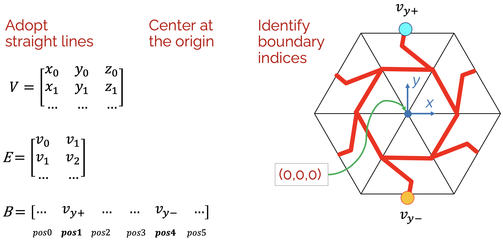

# Metamaterial Design and Optimization
Activity for the SIGCHI Summer School

# Installation
Open a Terminal.
Change the current working directory to the location of your repositories.

~~~
git clone https://github.com/flaccone/metamaterialdesign
~~~

Move to the repository root directory. Make sure you have Python installed.

Make sure you have a C++ compiler installed if you use Ubuntu (```sudo apt install build-essential```) or macOS (XCode from the App Store). Make sure you have Cmake installed on macOS.

If you use macOS with ARM, as a first step, install ```pymeshlab``` and ```nlopt``` requiring a wheel:
~~~
pip install ./m1_wheels/pymeshlab/pymeshlab-2023.12-<YOUR PYTHON VERSION>.whl
pip install ./m1_wheels/nlopt/nlopt-2.7.1-<YOUR PYHTON VERSION>.whl
~~~

Then, install all other dependencies:
~~~
pip install -r requirements.txt
~~~

If you use Ubuntu or Win, install all dependencies with:
~~~
pip install -r requirements.txt
~~~


# Task  
The participant is required to conceive a parametric pattern that is embedded in a regular hexagon. The pattern will be employed in a tassellated strip made of 5 hexagons that are bent out of plane from the extremities as a metamaterial strip.

The task consists in creating a new pattern class in ```./src/patterns.py``` using the ```Pattern(Protocol)```.

Such class is required to expose a design parameter, which will be later used as optimization variable, see for instance ```MyPattern(Pattern)``` in ```./src/patterns.py```.

The pattern class outputs the vertex matrix, the edge matrix and the ```boundary_vertices```, i.e., a np.array of indices for the vertices that are on the edges of the hexagon.
It is mandatory for tileability that the boundary vertices are on the hexagon edge midpoint, and that the these boundary indices are ordered as in this figure.




# Code usage
If the code is run as is, the result will show the bending scenario that optimizes ```MyPattern()``` to achieve the end goal of the project, i.e. a target bending deformation.

In ```./src/main.py```, the participant is asked to replace ```MyPattern``` (line 9, 41 and 58) with his/her own pattern class.

The ```options``` dictionary (line 10 in ```./src/main.py```) allows the user to test his/her design before performing the optimization task.

In particular:

```'pattern preview'``` if True shows a pyvista 3D preview of the pattern with vetices and edges indices.

```'load simulations``` > 0, performs for a given max force the input number of bending scenarios.

```'design parameter sensitivity'``` constructs a 3D design domain showing displacement vs design parameter vs load.

```'optimization scenario'``` if True performs the optimization task of finding the best parameter value so tha the deformed shape of the tassellated strip is close to a target one.

```'save file for 3D print'``` if True outputs a solid mesh.

```opt_init_parameters``` np.array containing the (five) initialization values of the optimization variables, i.e., one design parameter per pattern (hexagon)

```opt_lower_bounds```  np.array containig the lower bounds for the optimization variables

```opt_upper_bounds```  np.array containig the upper bounds for the optimization variables

